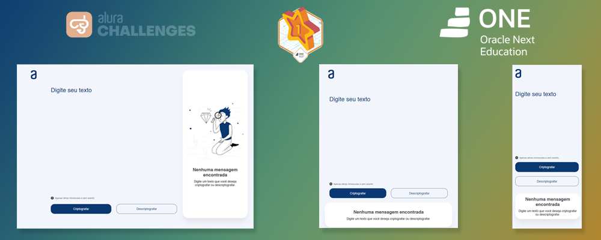

    ⚠ Em construção ⚠

    

  
  
  

<h1 align="center">
  Decodificador de textos - Challenge ONE + Alura
</h1>

Este projeto é um SPA (Single Page Application) em React que tem como objetivo criptografar e descriptografar uma mensagem de texto digitada pelo usuário. O aplicativo possui uma interface com um campo de entrada de texto e um campo de saída, e o usuário pode escolher criptografar ou descriptografar a mensagagem e copiar o resultado para a área de transferência através dos botões.

<h2>Criptografia</h2>

- A letra "e" é convertida para "enter"
- A letra "i" é convertida para "imes"
- A letra "a" é convertida para "ai"
- A letra "o" é convertida para "ober"
- A letra "u" é convertida para "ufat"

